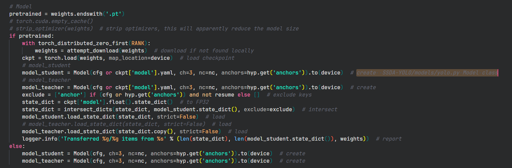

[https://zhuanlan.zhihu.com/p/663982091](https://zhuanlan.zhihu.com/p/663982091)
[https://zhuanlan.zhihu.com/p/597831489](https://zhuanlan.zhihu.com/p/597831489)
[https://blog.csdn.net/Mecaly/article/details/136398274](https://blog.csdn.net/Mecaly/article/details/136398274)
[https://blog.csdn.net/m0_69285615/article/details/136929451](https://blog.csdn.net/m0_69285615/article/details/136929451)

[mean teacher blog](https://bitlines.github.io/2020/03/22/%E6%9C%BA%E5%99%A8%E5%AD%A6%E4%B9%A0-%E5%8D%8A%E7%9B%91%E7%9D%A3%E5%AD%A6%E4%B9%A0-Mean-Teacher/)

[知识蒸馏(Knowledge Distillation)、半监督学习(semi-supervised learning)以及弱监督学习(weak-supervised learning)](https://blog.csdn.net/qq_39426225/article/details/105563710)

[CVPR 2023 | 用于半监督目标检测的知识蒸馏方法](https://www.wanweixueshu.com/news/detail/60202)

# 代码学习

## 模型加载
主要的蒸馏等过程在 `SSDA-YOLO/ssda_yolov5_train.py`中

135行 创建Model create from SSDA-YOLO/models/yolo.py Model class



```python
    # Update models weights [only by this way, we can resume the old training normally...][ref models.experimental.attempt_load()]
    if student_weight != "None" and teacher_weight != "None":  # update model_student and model_teacher
        torch.cuda.empty_cache()
        ckpt_student = torch.load(student_weight, map_location=device)  # load checkpoint
        state_dict_student = ckpt_student['ema' if ckpt_student.get('ema') else 'model'].float().half().state_dict()  # to FP32
        model_student.load_state_dict(state_dict_student, strict=False)  # load
        del ckpt_student, state_dict_student
        
        ckpt_teacher = torch.load(teacher_weight, map_location=device)  # load checkpoint
        state_dict_teacher = ckpt_teacher['ema' if ckpt_teacher.get('ema') else 'model'].float().half().state_dict()  # to FP32
        model_teacher.load_state_dict(state_dict_teacher, strict=False)  # load
        del ckpt_teacher, state_dict_teacher
```

> 这段代码的主要功能是从指定的权重文件中加载模型的权重，并将这些权重加载到学生模型（model_student）和教师模型（model_teacher）中。具体步骤如下：

>检查权重文件是否存在：首先检查student_weight和teacher_weight变量是否不等于字符串"None"。这意味着只有当这两个变量都指向有效的权重文件时，代码才会执行后续的权重加载操作。

>清理GPU缓存：使用torch.cuda.empty_cache()来清空显存，这对于在GPU上训练深度学习模型时，尤其是在有限显存的情况下，释放不再使用的内存是非常重要的。

>加载学生模型权重：

>使用torch.load(student_weight, map_location=device)来加载学生模型的权重文件。map_location=device参数指定了加载的权重应该被映射到哪个设备（CPU或GPU）。

>检查权重文件中是否存在'ema'键，如果存在，就使用'ema'的值作为状态字典，否则使用'model'的值。这是为了兼容使用EMA（Exponential Moving Average）优化的模型权重。
>将权重文件中的状态字典转换为float类型，并进一步转换为half类型（即FP16），这有助于减少显存占用并加快训练速度。
>使用model_student.load_state_dict(state_dict_student, strict=False)将状态字典加载到学生模型中。strict=False允许模型加载部分匹配的状态字典，这对于模型结构有微小变化的情况特别有用。
>清理临时变量：使用del语句删除ckpt_student和state_dict_student临时变量，以进一步释放内存。

>重复上述步骤加载教师模型权重：代码的后半部分重复了上述步骤，只是将目标模型从学生模型变为了教师模型。

>总结来说，这段代码的主要目的是在训练过程中允许从之前的检查点恢复训练，这对于长时间的训练过程中的断点续训非常有用。

## 蒸馏策略

### EMA

EMA方法在 `SSDA-YOLO/utils/torch_utils.py` ModelEMA class中

```python
if v.dtype.is_floating_point:
    v *= d
    v += (1. - d) * msd[k].detach()
```
$$
P_t = \gamma * P_t  + (1-\gamma) * P_s
$$
> 更新权重：如果权重的类型为浮点数，则使用EMA方法更新权重。具体的更新公式为：v = v * d + (1 - d) * msd[k].detach()，其中v为当前权重即$P_t$，d为衰减率，msd[k]为前一轮迭代的权重即$P_s$。detach()函数用于将张量从计算图中分离，以防止计算图中出现循环依赖。 d= 0.9999

### 蒸馏损失函数

## 前向传播 487行开始

分为4个batch

batch1： model student image sourcce real

loss<-source real prediction, source real ground truth

batch2： model student image source fake

loss<- source fake prediction, source real ground truth

batch3： model teacher image target fake


batcht4: model student iamge target 


### loss 计算

line 542 `loss = loss_sr + loss_sf + loss_distillation * lambda_weight`

`loss_items = loss_items_sr + loss_items_sf + loss_items_distillation * lambda_weight`
