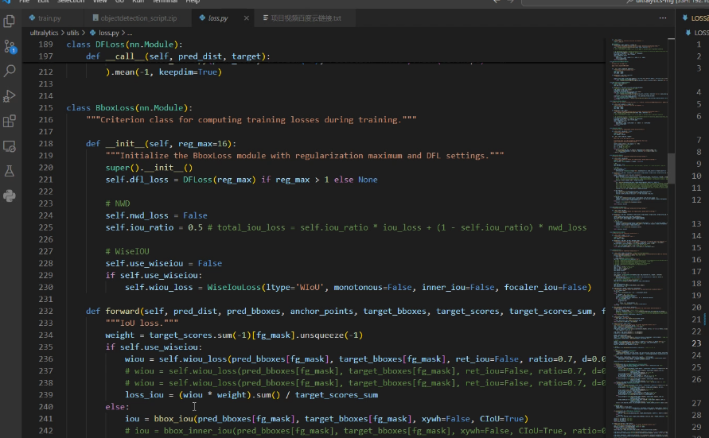
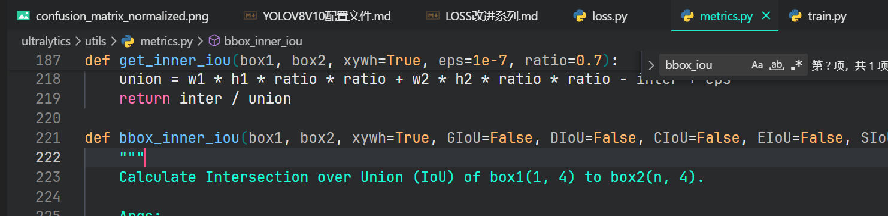

# AFPN
> 14. ultralytics/cfg/models/v8/yolov8-attention.yaml
>    可以看项目视频-如何在yaml配置文件中添加注意力层  
>    多种注意力机制在yolov8中的使用. [多种注意力机制github地址](https://github.com/z1069614715/objectdetection_script/tree/master/cv-attention)   Network[reference](https://github.com/gyyang23/AFPN/tree/master)
>
>    a. ultralytics/cfg/models/v8/yolov8-AFPN-P345.yaml  
>    b. ultralytics/cfg/models/v8/yolov8-AFPN-P345-Custom.yaml  
>    c. ultralytics/cfg/models/v8/yolov8-AFPN-P2345.yaml  
>    d. ultralytics/cfg/models/v8/yolov8-AFPN-P2345-Custom.yaml  
>    其中Custom中的block支持这些[结构](#b) [B站介绍说明](https://www.bilibili.com/video/BV1bh411A7yj/)

>
## 介绍

AFPN(Asymmetric Feature Pyramid Network)是一种多尺度特征融合网络，其主要思想是通过不同尺度的特征图来增强特征的丰富性，从而提升模型的性能。

## 文件
`ultralytics/cfg/models/v8/yolov8-AFPN-P345.yaml`

`ultralytics/nn/extra_modules/afpn.py`

## 参考

[知乎](https://zhuanlan.zhihu.com/p/640457255)

[yolov5中添加afpn](https://blog.csdn.net/athrunsunny/article/details/131566311?spm=1001.2014.3001.5501)

[论文](https://arxiv.org/abs/2306.15988v1)

[code](https://github.com/gyyang23/AFPN)

[bibili视频](https://www.bilibili.com/video/BV1bh411A7yj/)

# 定位损失函数

## 方法

loss.py中`iou = bbox_iou(pred_bboxes[fg_mask], target_bboxes[fg_mask], xywh=False, CIoU=True)`中对应IoU改为True，即使用CIoU。其他同理。



bbox_iou函数中在下图中。


改为非bbox_iou函数同样，例如

```python
#iou = bbox_iou(pred_bboxes[fg_mask], target_bboxes[fg_mask], xywh=False, CIoU=True)
iou = bbox_inner_iou(pred_bboxes[fg_mask], target_bboxes[fg_mask], xywh=False, CIoU=True, ratio=0.7)
```

